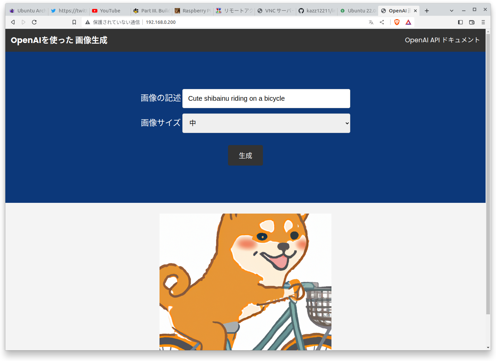
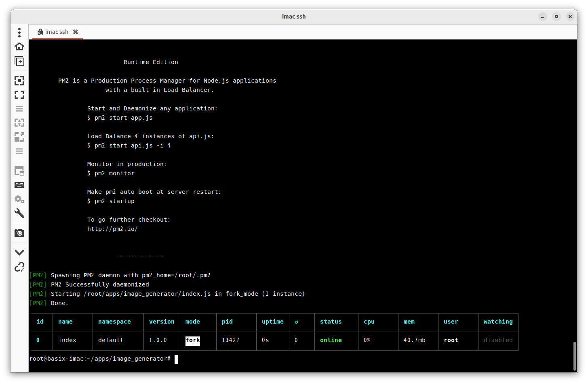
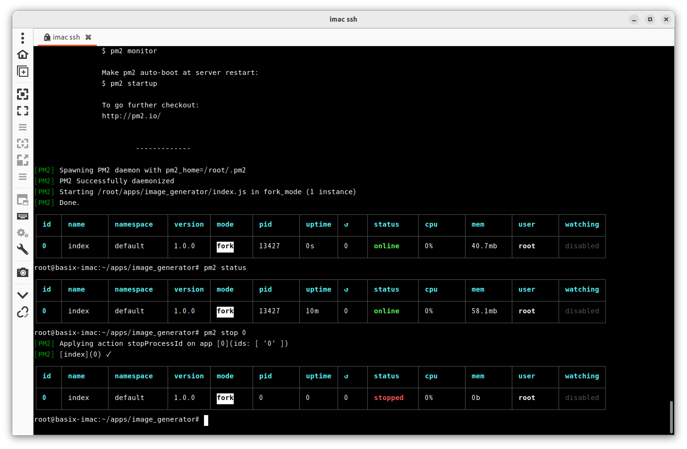
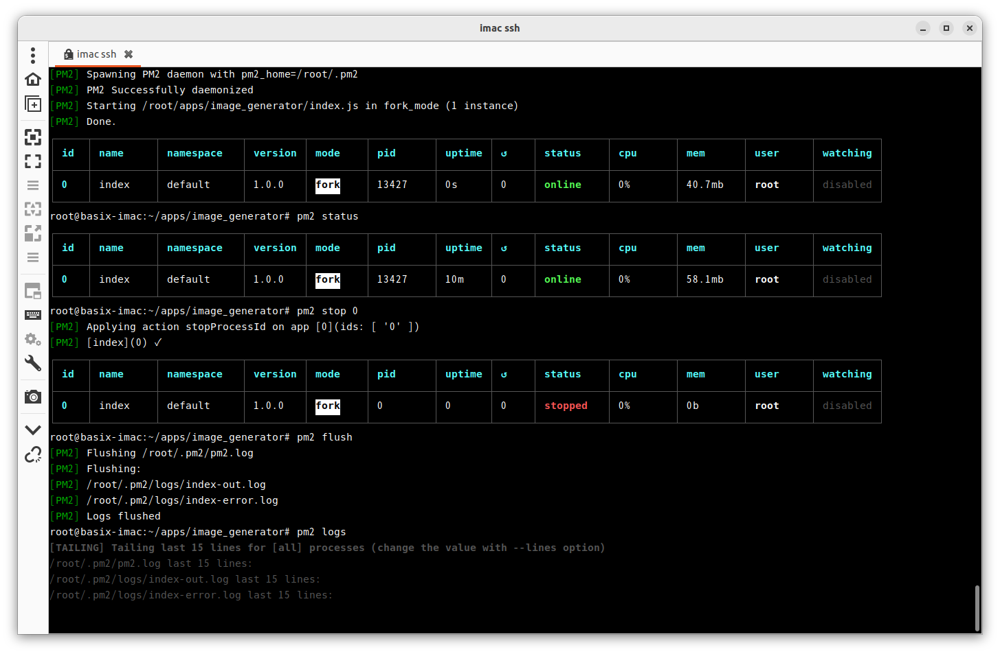
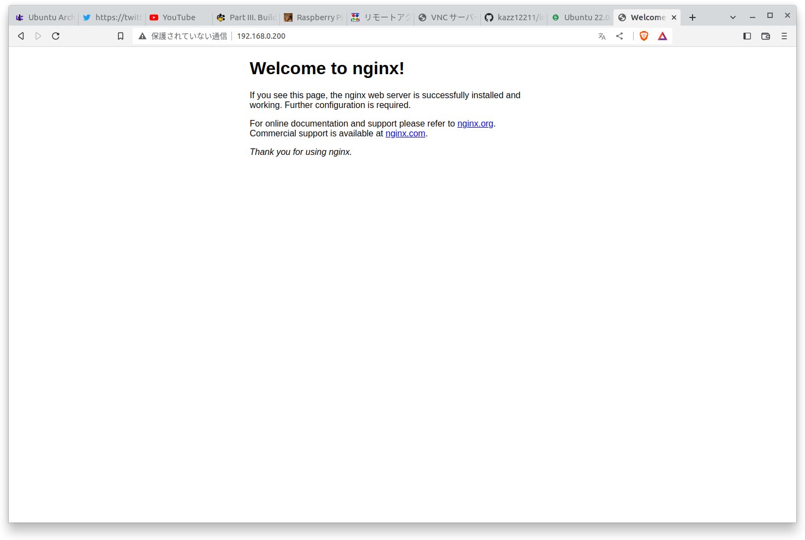
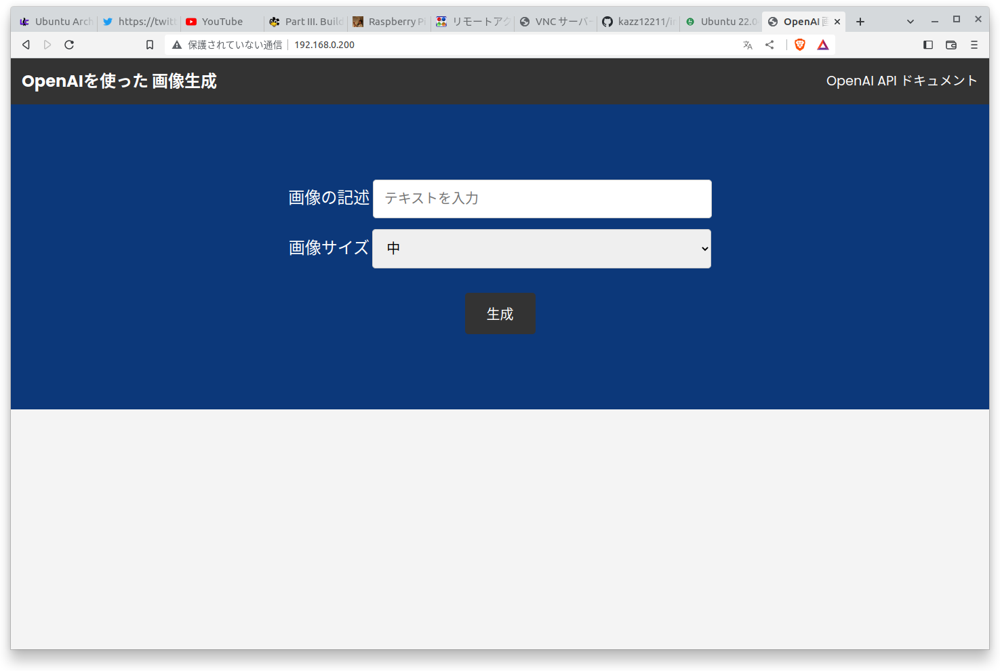

# image_generatorをnginxにデプロイする

[https://github.com/kazz12211/image_generator](https://github.com/kazz12211/image_generator)をUbuntu 22.04LTSで稼働するNginxにデプロイする手順。



## Ubuntuリポジトリに登録されているNodejsのバージョンを確認する

コマンド
```
$ apt show nodejs
```
実行結果
```
Package: nodejs
Version: 12.22.9~dfsg-1ubuntu3
Priority: extra
Section: universe/web
Origin: Ubuntu
Maintainer: Ubuntu Developers <ubuntu-devel-discuss@lists.ubuntu.com>
Original-Maintainer: Debian Javascript Maintainers <pkg-javascript-devel@alioth-lists.debian.net>
Bugs: https://bugs.launchpad.net/ubuntu/+filebug
Installed-Size: 932 kB
Provides: node-types-node (= 12.20.42~12.22.9~dfsg-1ubuntu3)
Depends: libc6 (>= 2.34), libnode72 (= 12.22.9~dfsg-1ubuntu3)
Recommends: ca-certificates, nodejs-doc
Suggests: npm
Breaks: node-babel-runtime (<< 7), node-typescript-types (<< 20210110~)
Homepage: https://nodejs.org/
Download-Size: 122 kB
APT-Sources: http://jp.archive.ubuntu.com/ubuntu jammy/universe amd64 Packages
Description: evented I/O for V8 javascript - runtime executable
 Node.js is a platform built on Chrome's JavaScript runtime for easily
 building fast, scalable network applications. Node.js uses an
 event-driven, non-blocking I/O model that makes it lightweight and
 efficient, perfect for data-intensive real-time applications that run
 across distributed devices.
 .
 Node.js is bundled with several useful libraries to handle server
 tasks:
 .
 System, Events, Standard I/O, Modules, Timers, Child Processes, POSIX,
 HTTP, Multipart Parsing, TCP, DNS, Assert, Path, URL, Query Strings.
```

## curlがインストールされていなければインストールする。

コマンド
```
$ sudo apt install curl
```
実行結果
```
パッケージリストを読み込んでいます... 完了
依存関係ツリーを作成しています... 完了        
状態情報を読み取っています... 完了        
以下のパッケージが新たにインストールされます:
  curl
アップグレード: 0 個、新規インストール: 1 個、削除: 0 個、保留: 8 個。
193 kB のアーカイブを取得する必要があります。
この操作後に追加で 453 kB のディスク容量が消費されます。
取得:1 http://jp.archive.ubuntu.com/ubuntu jammy-updates/main amd64 curl amd64 7.81.0-1ubuntu1.7 [193 kB]
193 kB を 2秒 で取得しました (121 kB/s)
以前に未選択のパッケージ curl を選択しています。
(データベースを読み込んでいます ... 現在 209390 個のファイルとディレクトリがインストールされています。)
.../curl_7.81.0-1ubuntu1.7_amd64.deb を展開する準備をしています ...
curl (7.81.0-1ubuntu1.7) を展開しています...
curl (7.81.0-1ubuntu1.7) を設定しています ...
man-db (2.10.2-1) のトリガを処理しています ...
```

## Nodejsの新版（ここでは18.x）のPPAを追加する。

コマンド
```
$ curl -fsSL https://deb.nodesource.com/setup_18.x | sudo -E bash -
``
実行結果
```
## Installing the NodeSource Node.js 18.x repo...


## Populating apt-get cache...

+ apt-get update
ヒット:1 http://jp.archive.ubuntu.com/ubuntu jammy InRelease                                                                           
取得:2 http://security.ubuntu.com/ubuntu jammy-security InRelease [110 kB]                                                             
取得:3 http://jp.archive.ubuntu.com/ubuntu jammy-updates InRelease [114 kB]                                                   
ヒット:4 https://ppa.launchpadcontent.net/mozillateam/ppa/ubuntu jammy InRelease                                                 
取得:5 http://jp.archive.ubuntu.com/ubuntu jammy-backports InRelease [107 kB]                     
取得:6 http://security.ubuntu.com/ubuntu jammy-security/main amd64 DEP-11 Metadata [41.6 kB]
取得:7 http://jp.archive.ubuntu.com/ubuntu jammy-updates/main i386 Packages [429 kB]
取得:8 http://security.ubuntu.com/ubuntu jammy-security/universe amd64 DEP-11 Metadata [13.3 kB]
取得:9 http://jp.archive.ubuntu.com/ubuntu jammy-updates/main amd64 Packages [852 kB]
取得:10 http://jp.archive.ubuntu.com/ubuntu jammy-updates/main amd64 DEP-11 Metadata [101 kB]
取得:11 http://jp.archive.ubuntu.com/ubuntu jammy-updates/main amd64 c-n-f Metadata [13.2 kB]
取得:12 http://jp.archive.ubuntu.com/ubuntu jammy-updates/universe i386 Packages [567 kB]
取得:13 http://jp.archive.ubuntu.com/ubuntu jammy-updates/universe amd64 Packages [797 kB]
取得:14 http://jp.archive.ubuntu.com/ubuntu jammy-updates/universe amd64 DEP-11 Metadata [265 kB]
取得:15 http://jp.archive.ubuntu.com/ubuntu jammy-updates/universe amd64 c-n-f Metadata [15.1 kB]
取得:16 http://jp.archive.ubuntu.com/ubuntu jammy-updates/multiverse amd64 DEP-11 Metadata [940 B]
取得:17 http://jp.archive.ubuntu.com/ubuntu jammy-backports/main amd64 DEP-11 Metadata [7,992 B]
取得:18 http://jp.archive.ubuntu.com/ubuntu jammy-backports/universe amd64 DEP-11 Metadata [12.4 kB]
3,447 kB を 4秒 で取得しました (925 kB/s)
パッケージリストを読み込んでいます... 完了

```## Confirming "jammy" is supported...

+ curl -sLf -o /dev/null 'https://deb.nodesource.com/node_18.x/dists/jammy/Release'

## Adding the NodeSource signing key to your keyring...

+ curl -s https://deb.nodesource.com/gpgkey/nodesource.gpg.key | gpg --dearmor | tee /usr/share/keyrings/nodesource.gpg >/dev/null
gpg: *警告*: homedir '/home/ktsubaki/.gnupg'の安全でない所有

## Creating apt sources list file for the NodeSource Node.js 18.x repo...

+ echo 'deb [signed-by=/usr/share/keyrings/nodesource.gpg] https://deb.nodesource.com/node_18.x jammy main' > /etc/apt/sources.list.d/nodesource.list
+ echo 'deb-src [signed-by=/usr/share/keyrings/nodesource.gpg] https://deb.nodesource.com/node_18.x jammy main' >> /etc/apt/sources.list.d/nodesource.list

## Running `apt-get update` for you...

+ apt-get update
取得:1 https://deb.nodesource.com/node_18.x jammy InRelease [4,563 B]
取得:2 https://deb.nodesource.com/node_18.x jammy/main amd64 Packages [774 B]                                                                       
ヒット:3 http://jp.archive.ubuntu.com/ubuntu jammy InRelease                                                                                        
ヒット:4 http://security.ubuntu.com/ubuntu jammy-security InRelease                                                                                 
ヒット:5 http://jp.archive.ubuntu.com/ubuntu jammy-updates InRelease                                                       
ヒット:6 https://ppa.launchpadcontent.net/mozillateam/ppa/ubuntu jammy InRelease             
ヒット:7 http://jp.archive.ubuntu.com/ubuntu jammy-backports InRelease
5,337 B を 2秒 で取得しました (3,206 B/s)
パッケージリストを読み込んでいます... 完了

## Run `sudo apt-get install -y nodejs` to install Node.js 18.x and npm
## You may also need development tools to build native addons:
     sudo apt-get install gcc g++ make
## To install the Yarn package manager, run:
     curl -sL https://dl.yarnpkg.com/debian/pubkey.gpg | gpg --dearmor | sudo tee /usr/share/keyrings/yarnkey.gpg >/dev/null
     echo "deb [signed-by=/usr/share/keyrings/yarnkey.gpg] https://dl.yarnpkg.com/debian stable main" | sudo tee /etc/apt/sources.list.d/yarn.list
     sudo apt-get update && sudo apt-get install yarn
```

## UbuntuリポジトリのNodejsのバージョンを再度確認してバージョンが18.xになっているかを見る

コマンド
```
$ apt show nodejs
```
実行結果
```
Package: nodejs
Version: 18.14.0-deb-1nodesource1
Priority: optional
Section: web
Maintainer: Ivan Iguaran <ivan@nodesource.com>
Installed-Size: 186 MB
Provides: nodejs-dev, nodejs-doc, nodejs-legacy, npm
Depends: libc6 (>= 2.17), libgcc1 (>= 1:3.4), libstdc++6 (>= 5.2), python3-minimal, ca-certificates
Conflicts: nodejs-dev, nodejs-doc, nodejs-legacy, npm
Replaces: nodejs-dev (<= 0.8.22), nodejs-legacy, npm (<= 1.2.14)
Homepage: https://nodejs.org
Download-Size: 28.5 MB
APT-Sources: https://deb.nodesource.com/node_18.x jammy/main amd64 Packages
Description: Node.js event-based server-side javascript engine
 Node.js is similar in design to and influenced by systems like
 Ruby's Event Machine or Python's Twisted.
 .
 It takes the event model a bit further - it presents the event
 loop as a language construct instead of as a library.
 .
 Node.js is bundled with several useful libraries to handle server tasks :
 System, Events, Standard I/O, Modules, Timers, Child Processes, POSIX,
 HTTP, Multipart Parsing, TCP, DNS, Assert, Path, URL, Query Strings.

N: 追加レコードが 1 件あります。表示するには '-a' スイッチを付けてください。
```


## Nodejsをインストールする

コマンド
```
$ sudo apt install nodejs
```
実行結果
```
パッケージリストを読み込んでいます... 完了
依存関係ツリーを作成しています... 完了        
状態情報を読み取っています... 完了        
以下のパッケージが新たにインストールされます:
  nodejs
アップグレード: 0 個、新規インストール: 1 個、削除: 0 個、保留: 11 個。
28.5 MB のアーカイブを取得する必要があります。
この操作後に追加で 186 MB のディスク容量が消費されます。
取得:1 https://deb.nodesource.com/node_18.x jammy/main amd64 nodejs amd64 18.14.0-deb-1nodesource1 [28.5 MB]
28.5 MB を 3秒 で取得しました (9,433 kB/s)
以前に未選択のパッケージ nodejs を選択しています。
(データベースを読み込んでいます ... 現在 209397 個のファイルとディレクトリがインストールされています。)
.../nodejs_18.14.0-deb-1nodesource1_amd64.deb を展開する準備をしています ...
nodejs (18.14.0-deb-1nodesource1) を展開しています...
nodejs (18.14.0-deb-1nodesource1) を設定しています ...
man-db (2.10.2-1) のトリガを処理しています ...
```


## インストールされたNodejsのバージョンを確認

コマンド
```
$ node -v
```
実行結果
```
v18.14.0
```

## NPMのバージョンを確認
コマンド
```
$ npm -v
```
実行結果
```
9.3.1
```

## ここからスーパーユーザーで作業する
```
$ sudo su -
```

## アプリケーションを保存するディレクトリを作成してそこに移動

```
# cd 
# mkdir apps
# cd apps
```

## Githubのリポジトリからimage_generatorをクローンする

```
# git clone https://github.com/kazz12211/image_generator.git
```

## image_generatorのディレクトリに移動する
```
# cd image_generator
```

## Nodeのライブラリーをインストールする
コマンド
```
# npm install
```
実行結果
```
added 97 packages, and audited 98 packages in 4s

11 packages are looking for funding
  run `npm fund` for details

found 0 vulnerabilities
```
## image_generatorの環境変数設定ファイルを作成して編集する
```
# touch .env
# nano .env
```
編集内容
```
PORT = 5000
OPENAI_API_KEY = 'OpenAIから取得したAPIキー'
```

## 試しにアプリケーションを実行する
```
# npm start
```

## NodejsアプリのランタイムマネージャーPM2をインストールする

コマンド
```
# npm install -g pm2
```
実行結果
```
npm WARN deprecated uuid@3.4.0: Please upgrade  to version 7 or higher.  Older versions may use Math.random() in certain circumstances, which is known to be problematic.  See https://v8.dev/blog/math-random for details.

added 184 packages in 18s

12 packages are looking for funding
  run `npm fund` for details
```
## image_generatorをPM2で実行してみる
```
# pm2 start index.js
```


## PM2のコマンドをいくつか試す
```
# pm2 status

# pm2 stop 0
```

```
# pm2 flush

# pm2 logs
```


## PM2がOS起動時に起動するように設定する

コマンド
```
# pm2 startup ubuntu
```
実行結果
```
[PM2] Init System found: systemd
-----------------------------------------------------------
 PM2 detected systemd but you precised ubuntu
 Please verify that your choice is indeed your init system
 If you arent sure, just run : pm2 startup
-----------------------------------------------------------
Platform ubuntu
Template
[Unit]
Description=PM2 process manager
Documentation=https://pm2.keymetrics.io/
After=network.target

[Service]
Type=forking
User=root
LimitNOFILE=infinity
LimitNPROC=infinity
LimitCORE=infinity
Environment=PATH=/usr/local/sbin:/usr/local/bin:/usr/sbin:/usr/bin:/sbin:/bin:/usr/games:/usr/local/games:/snap/bin:/bin:/usr/local/sbin:/usr/local/bin:/usr/sbin:/usr/bin
Environment=PM2_HOME=/root/.pm2
PIDFile=/root/.pm2/pm2.pid
Restart=on-failure

ExecStart=/usr/lib/node_modules/pm2/bin/pm2 resurrect
ExecReload=/usr/lib/node_modules/pm2/bin/pm2 reload all
ExecStop=/usr/lib/node_modules/pm2/bin/pm2 kill

[Install]
WantedBy=multi-user.target

Target path
/etc/systemd/system/pm2-root.service
Command list
[ 'systemctl enable pm2-root' ]
[PM2] Writing init configuration in /etc/systemd/system/pm2-root.service
[PM2] Making script booting at startup...
[PM2] [-] Executing: systemctl enable pm2-root...
Created symlink /etc/systemd/system/multi-user.target.wants/pm2-root.service → /etc/systemd/system/pm2-root.service.
[PM2] [v] Command successfully executed.
+---------------------------------------+
[PM2] Freeze a process list on reboot via:
$ pm2 save

[PM2] Remove init script via:
$ pm2 unstartup ubuntu
```

## Nginxをインストールする

コマンド
```
# apt install nginx
```
実行結果
```
パッケージリストを読み込んでいます... 完了
依存関係ツリーを作成しています... 完了        
状態情報を読み取っています... 完了        
以下の追加パッケージがインストールされます:
  libnginx-mod-http-geoip2 libnginx-mod-http-image-filter libnginx-mod-http-xslt-filter libnginx-mod-mail libnginx-mod-stream
  libnginx-mod-stream-geoip2 nginx-common nginx-core
提案パッケージ:
  fcgiwrap nginx-doc
以下のパッケージが新たにインストールされます:
  libnginx-mod-http-geoip2 libnginx-mod-http-image-filter libnginx-mod-http-xslt-filter libnginx-mod-mail libnginx-mod-stream
  libnginx-mod-stream-geoip2 nginx nginx-common nginx-core
アップグレード: 0 個、新規インストール: 9 個、削除: 0 個、保留: 11 個。
696 kB のアーカイブを取得する必要があります。
この操作後に追加で 2,395 kB のディスク容量が消費されます。
続行しますか? [Y/n] y
取得:1 http://jp.archive.ubuntu.com/ubuntu jammy-updates/main amd64 nginx-common all 1.18.0-6ubuntu14.3 [40.0 kB]
取得:2 http://jp.archive.ubuntu.com/ubuntu jammy-updates/main amd64 libnginx-mod-http-geoip2 amd64 1.18.0-6ubuntu14.3 [11.9 kB]
取得:3 http://jp.archive.ubuntu.com/ubuntu jammy-updates/main amd64 libnginx-mod-http-image-filter amd64 1.18.0-6ubuntu14.3 [15.4 kB]
取得:4 http://jp.archive.ubuntu.com/ubuntu jammy-updates/main amd64 libnginx-mod-http-xslt-filter amd64 1.18.0-6ubuntu14.3 [13.7 kB]
取得:5 http://jp.archive.ubuntu.com/ubuntu jammy-updates/main amd64 libnginx-mod-mail amd64 1.18.0-6ubuntu14.3 [45.7 kB]
取得:6 http://jp.archive.ubuntu.com/ubuntu jammy-updates/main amd64 libnginx-mod-stream amd64 1.18.0-6ubuntu14.3 [72.8 kB]
取得:7 http://jp.archive.ubuntu.com/ubuntu jammy-updates/main amd64 libnginx-mod-stream-geoip2 amd64 1.18.0-6ubuntu14.3 [10.1 kB]
取得:8 http://jp.archive.ubuntu.com/ubuntu jammy-updates/main amd64 nginx-core amd64 1.18.0-6ubuntu14.3 [482 kB]
取得:9 http://jp.archive.ubuntu.com/ubuntu jammy-updates/main amd64 nginx amd64 1.18.0-6ubuntu14.3 [3,882 B]
696 kB を 3秒 で取得しました (276 kB/s)
パッケージを事前設定しています ...
以前に未選択のパッケージ nginx-common を選択しています。
(データベースを読み込んでいます ... 現在 214696 個のファイルとディレクトリがインストールされています。)
.../0-nginx-common_1.18.0-6ubuntu14.3_all.deb を展開する準備をしています ...
nginx-common (1.18.0-6ubuntu14.3) を展開しています...
以前に未選択のパッケージ libnginx-mod-http-geoip2 を選択しています。
.../1-libnginx-mod-http-geoip2_1.18.0-6ubuntu14.3_amd64.deb を展開する準備をしています ...
libnginx-mod-http-geoip2 (1.18.0-6ubuntu14.3) を展開しています...
以前に未選択のパッケージ libnginx-mod-http-image-filter を選択しています。
.../2-libnginx-mod-http-image-filter_1.18.0-6ubuntu14.3_amd64.deb を展開する準備をしています ...
libnginx-mod-http-image-filter (1.18.0-6ubuntu14.3) を展開しています...
以前に未選択のパッケージ libnginx-mod-http-xslt-filter を選択しています。
.../3-libnginx-mod-http-xslt-filter_1.18.0-6ubuntu14.3_amd64.deb を展開する準備をしています ...
libnginx-mod-http-xslt-filter (1.18.0-6ubuntu14.3) を展開しています...
以前に未選択のパッケージ libnginx-mod-mail を選択しています。
.../4-libnginx-mod-mail_1.18.0-6ubuntu14.3_amd64.deb を展開する準備をしています ...
libnginx-mod-mail (1.18.0-6ubuntu14.3) を展開しています...
以前に未選択のパッケージ libnginx-mod-stream を選択しています。
.../5-libnginx-mod-stream_1.18.0-6ubuntu14.3_amd64.deb を展開する準備をしています ...
libnginx-mod-stream (1.18.0-6ubuntu14.3) を展開しています...
以前に未選択のパッケージ libnginx-mod-stream-geoip2 を選択しています。
.../6-libnginx-mod-stream-geoip2_1.18.0-6ubuntu14.3_amd64.deb を展開する準備をしています ...
libnginx-mod-stream-geoip2 (1.18.0-6ubuntu14.3) を展開しています...
以前に未選択のパッケージ nginx-core を選択しています。
.../7-nginx-core_1.18.0-6ubuntu14.3_amd64.deb を展開する準備をしています ...
nginx-core (1.18.0-6ubuntu14.3) を展開しています...
以前に未選択のパッケージ nginx を選択しています。
.../8-nginx_1.18.0-6ubuntu14.3_amd64.deb を展開する準備をしています ...
nginx (1.18.0-6ubuntu14.3) を展開しています...
nginx-common (1.18.0-6ubuntu14.3) を設定しています ...
Created symlink /etc/systemd/system/multi-user.target.wants/nginx.service → /lib/systemd/system/nginx.service.
libnginx-mod-http-xslt-filter (1.18.0-6ubuntu14.3) を設定しています ...
libnginx-mod-http-geoip2 (1.18.0-6ubuntu14.3) を設定しています ...
libnginx-mod-mail (1.18.0-6ubuntu14.3) を設定しています ...
libnginx-mod-http-image-filter (1.18.0-6ubuntu14.3) を設定しています ...
libnginx-mod-stream (1.18.0-6ubuntu14.3) を設定しています ...
libnginx-mod-stream-geoip2 (1.18.0-6ubuntu14.3) を設定しています ...
nginx-core (1.18.0-6ubuntu14.3) を設定しています### ...
 * Upgrading binary nginx                                                                                                                     [ OK ] 
nginx (1.18.0-6ubuntu14.3) を設定しています ...
man-db (2.10.2-1) のトリガを処理しています ...
ufw (0.36.1-4build1) のトリガを処理しています ...
```

ブラウザからHTTPアクセスしてこのページが表示されればインストール成功。



## Nginxの設定ファイルを編集してHTTPのデフォルトポートでimage_generatorにアクセスできるように設定する

```
# nano /etc/nginx/sites-available/default
```
```
        location / {
                # First attempt to serve request as file, then
                # as directory, then fall back to displaying a 404.
                proxy_pass http://localhost:5000;
                proxy_http_version 1.1;
                proxy_set_header Upgrade $http_upgrade;
                proxy_set_header Connection 'upgrade';
                proxy_set_header Host $host;
                proxy_cache_bypass $http_upgrade;
        }
```

## Nginxの設定ファイルのテスト

コマンド
```
# nginx -t
```
実行結果
```
nginx: the configuration file /etc/nginx/nginx.conf syntax is ok
nginx: configuration file /etc/nginx/nginx.conf test is successful
```
## Nginxを再起動して変更した設定を反映する
```
# systemctl restart nginx
```

## アプリケーションにアクセスする

image_generatorにアクセスできました。


